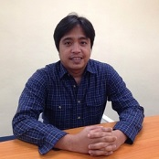

### About me

- Graduated from Asian Institute of Computer Studies and having more than 5 years of extensive experience in
developing company systems for RareJob Philippines Inc.
- Senior Developer in RareJob Phils since Sept. 2012
- Result driven, self driven, highly motivated, smart and hungry to learn new technologies, methodologies, strategies, and processes

### Strengths

- Good oral, written, & presentation skills
- A high tolerance for stress and enjoys responsibilities
- Quick learner & good grasping ability
- Very resourceful
- Lead & work as a team in an organized way
- Great time management skill

### Personal Information

- Date of Birth: February 17, 1978
- Sex: Male
- Status: Married with 2 kids
- Nationality: Filipino
- Languages Known: English & Filipino
- Contact information: rfdeguzman21@gmail.com | 09165330905

### Previous experiences

- Technical Support Representative/Professional from Sykes, HP, Dell, & StarTek
